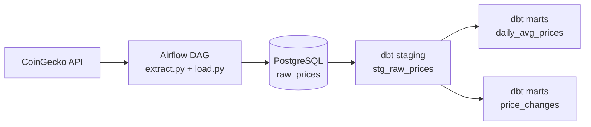

# Crypto Price Pipeline

An end-to-end data pipeline that ingests hourly cryptocurrency prices, stores raw data in PostgreSQL, and builds analytics-ready models with dbt.

## What This Project Does

This project collects market data for selected coins (currently Bitcoin and Dogecoin) from the CoinGecko API and processes it through a small modern data stack:

1. **Extract**: Pull latest prices and 24h change from CoinGecko.
2. **Load**: Write records into a PostgreSQL table (`raw_prices`).
3. **Orchestrate**: Run the workflow hourly with Apache Airflow.
4. **Transform**: Build staging and marts models with dbt for analysis.

### Data Products

- `stg_raw_prices`: cleaned/staged raw records
- `daily_avg_prices`: daily average/min/max prices and sample counts
- `price_changes`: latest 24h percentage change per coin

## Architecture



## Technologies Used

- **Python** (data extraction and loading)
- **Apache Airflow 2.9** (workflow orchestration and scheduling)
- **PostgreSQL 15** (storage layer)
- **dbt** (SQL transformations and analytics models)
- **Docker Compose** (local multi-service environment)
- **SQLAlchemy, pandas, requests, python-dotenv, psycopg2** (Python tooling)

## Project Structure

```text
airflow/dags/
  crypto_dag.py      # Airflow DAG (extract -> load -> health_check)
  extract.py         # CoinGecko API extraction logic
  load.py            # Load data into PostgreSQL

dbt/models/
  staging/stg_raw_prices.sql
  marts/daily_avg_prices.sql
  marts/price_changes.sql

docker-compose.yml   # Airflow + PostgreSQL local stack
```

## Quick Start

### 1. Prerequisites

- Docker + Docker Compose
- Python 3.10+ (optional for local scripts)
- dbt (if you want to run transformations from host)

### 2. Configure Environment

Create a `.env` file in the project root with values for:

- `POSTGRES_USER`
- `POSTGRES_PASSWORD`
- `POSTGRES_DB`
- `COINGECKO_API_KEY`

You may also need:

- `POSTGRES_HOST` (commonly `postgres` in Docker network, or `localhost` from host)
- `POSTGRES_PORT` (commonly `5432`)

### 3. Start Services

```bash
docker compose up -d
```

Airflow UI: `http://localhost:8080`

### 4. Run the Pipeline

- Enable and trigger DAG: `crypto_price_pipeline`
- Schedule is hourly (`@hourly`)

### 5. Run dbt Models

From the `dbt/` directory:

```bash
dbt run
dbt test
```

## What I Learned

This project helped me practice and understand:

- Building an end-to-end ELT pipeline from API to analytics tables
- Designing Airflow DAGs with task dependencies and retries
- Handling credentials and configuration with environment variables
- Loading tabular data into PostgreSQL with pandas + SQLAlchemy
- Modeling raw data into reusable staging and mart layers with dbt
- Turning operational pipeline output into business-friendly SQL models


